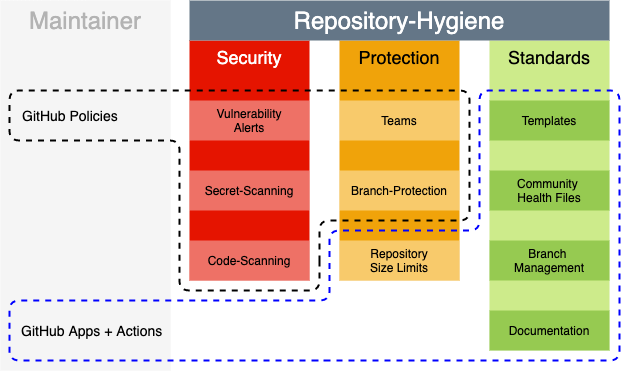

# GitHub Repository Hygiene Recommendations :sweat_drops:

The **WHY**, **WHAT**, and **HOW** of Repository Hygiene.

A GitHub recommendation on what should be considered part of Repo-Hygiene, and how to maintain it. 

There are multiple ways to look at Repository Hygiene and we do not claim to have the "one size fits all" solution.
What good Repository hygiene is to you, depends on what your priorities are. What we do in this doc is to point out important (useful) areas that can help you decide how to keep things clean.

>Note:  Good Repo-hygiene does not always guarantee good Repo-health but it does put you on the right track. 😷
---

## WHY ? 

### :bulb: Keep a clean Repository clean = Repo-Hygiene!

Even if your Repository appears to perform well on the GitHub platform and the owners don't currently voice any complaints, it is still crucial to prioritize Repository Hygiene. Here's why:

  - Any Repository that is "clean" today might not be so after the next commit.
  - A clean (healthy) Repository is fundamental for good collaboration!

There are several compelling reasons, beyond platform performance, that highlight the importance of implementing a robust Repository Hygiene process. These reasons can be broadly categorized into three key areas.

  |Security|Protection|Standards|
  |---|---|---|
  |Ensure that no secrets and  no vulnerabilities get committed|Enforce collaboration policies|Compliance rules to maintain a clean Repository and  ensure good collaboration|

GitHub places great importance on collaboration, a well-organized repository encourages easy participation and contribution, while minimizing the learning curve and potential risks of errors.
 > Note: The task to get a Repository in to a "clean" state is a pre-requirement. The Repository-Hygiene process goal is to maintain a clean environment.

---

## WHAT ? 

... 
 
### The scope of **Repo-Hygiene** for this document

  

---

## HOW ?

>Note: :warning: We purposely don't go too deep into the **'HOW'** of the Repo-Hygiene, since the implementation can heavily depend on individual company standards. 

### :bulb: Templates + Policies + Standards = Repo-Hygiene

||Checks|Description|Hygiene Task*|
|---|---|---|---|
|**Security**||||
||Dependabot Alerts (GHAS)|Monitor vulnerabilities in dependencies used in your project and keep your dependencies up-to-date|GitHub Platform feature / User configurable|
||Code Scanning (GHAS)|Use code scanning to find security vulnerabilities and errors in the code for your project|GitHub Platform feature / User configurable|
||Secret Scanning (GHAS)|Scanning repositories for known types of secrets|GitHub Platform feature / Admin configurable|
||Secret Push Prevention (GHAS)|Use secret scanning to prevent supported secrets from being pushed into your repository|GitHub Platform feature / Admin configurable|
|**Protection**||||
||Teams|Repository access permissions|GitHub Platform managed / Admin configurable|
||Branch Protection|Control how people can interact with branches in your repository|GitHub Platform feature / Admin configurable|
||Branch Limits|Limit the overall number of Branchces in a Repository|GitHub App/Action managed|
||Stale Branch Limits|Limit the number of Branches with no activity over the defined period of time|GitHub App/Action managed|
||.gitignore|Prevent the push of specific files at the GIT level|GitHub App/Action managed / User configurable|
||Repository Policies||GitHub Platform managed|
|||||
|**Standards**||||
||Issue Templates|Templates and forms to create standardized collaboration|PR check for template files|
||Pull Request Templates|Standardize Pull Request description content|PR check for template files|
||Default Community Health Files||PR check for health files|
||Documentation ! |To Explain - To Share - To Remember  Needs to be: - Accurate - Easy to understand - NOT irrelevant|GitHub Templates / User managed|
|||||

\* How to set it up and how to maintain it for Repo-Hygiene

### Repository Hygiene and Trust-Level

In a GitHub Organization, owners have the same control over a Repository as the Repository owners or adminstrators. Many of the policy features shown here allow for modifications on an adminstrator level.
If you want to enforce Repo-Hygiene standards even for that access level, you would need to use Apps or Actions to control this.
Keep in mind that GitHub WebHook events are reactionary and do not prevent the intial push to a Repository.
The general process is,

  - Detect
  - Report
  - Correct

